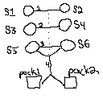

# HW4—Planning

## Warehouse Robots!

Welcome to your new job at _Wilson Robotics_. You've been tasked with helping write the managerial software for the 
new high-tech warehouses located in Navi Mumbai.

The job is pretty straightfoward: _Wilson Robotics_ has a number of fancy 
pallet-moving robots that can help out in their warehouses, but they
haven't yet written software to control them. That's where you come
in. You'll be applying your knowledge of AI to get these robots to move stock around the 
warehouse.

The robots are capable of picking up pallets and moving them around 
the warehouse. Strong they might be, dextrous they are not. They can
get the pallets to the unloading area, but they need to rely on humans
to take the specific items off of them. This is typical of the real
world, where robots are _really_ good at parts of tasks that humans
fail at, but they drop the ball completely when it comes to things like 
fine motor control.

## Your Task

* Fill in the __domain__ file so that the remote planner can create a plan
to solve each of first five problem definitions.

You have been given ___seven___ problem definitions and a skeleton of a 
domain file. The first five are problems that your domain __needs to be
able to solve__, the sixth and seventh are problems that your domain
should __fail to create a plan for__. This is to help you verify that
you're creating a domain that accounts for things like not 
allowing an individual stock item to be in multiple shipments. _There
will be tests like this in the grading setup that we (BroadLeaf's
designated testing firm) will use to test your software before it goes
into production_. You will get graded on whether you pass/fail tests that
we expect you to.

### The Domain File

We've given you a (very sparse) domain file. It contains the domain
name and the relevant PDDL requirements:

```
(define (domain sokorobotto)
  (:requirements :typing)
  (:types  )
  (:predicates  )
)
```

Your job is to add a number of things:

1. The `:types` of all of the objects in your domain.
2. The names of all of your `:predicates`. For the sake of grading, you
need to, at a minimum, include the predicate `includes`. You'll want a
bunch of intermediate predicates too, but you can name them whatever
you want. For the record, our domain definition has about fifteen.
3. The detailed specifications of all necessary actions, including parameters, pre-conditions,
and effects.


### Testing Your Work

We've given you a total of __seven__ problem definitions. The first five
are tests that you need to __pass__. They increase in complexity, so don't
be surprised if initially you pass the first few but not the later 
ones.

The __problem5_fail.pddl__ and __problem6_fail.pddl__ are tests that you __should fail__. They're there to validate that your pre-conditions and effects are in good
shape.

Test your domain definitions using
```
python test.py <domain file> <problem file> [-v]
```
* The script will run for a bit (for more complicated problems, upwards
of ten seconds) and then give you the results ("ok" for a successful plan
or an error message otherwise).
* The full results also get stored in `<problem file name>_results.json`.
* The `-v` flag can be used print more detailed information: the successful
plan if one is found, or (minor) additional error information if not.

## Notes

* For an example domain/problem definition, you can find an online PDDL
(Planning Domain Definition Language) editor [here](http://editor.planning.domains/#).
Click on `Import`, and you'll find
a ton of old definitions from, e.g., planning competitions. We looked at the IFC-2011 "barman" problem for guidance on how to write our PDDL files. You may find it useful.

* One of the more confusing things about PDDL is that not every predicate in the list of predicates is an 
action. For instance, `includes` isn't an action, but things that, e.g., move pallets around, are.

* Here is a drawing of the Problem 4 warehouse layout:



## On PDDL

1. It is recommended that you work on the PDDL locally, running it using the provided script.
2. One good IDE to use to work on your PDDL is Visual Studio Code, for which there's a good extension available [here](https://marketplace.visualstudio.com/items?itemName=jan-dolejsi.pddl), which lets you view PDDL predicates and keywords in color.
3. Alternatively, you may choose to work on your domain PDDL directly in [this](http://editor.planning.domains/#) online PDDL editor. Just remember to download your code and push it to your Github assignment repo.
4. In the online PDDL editor, you can use the __File -> Load__ option to load PDDL files.
5. Unfortunately, the PDDL service doesn't give the greatest error messages, so you may have to put your debugging hat on and get deep into your PDDL to find any problems that cause a plan not to be found.
6. Remember, if you find a plan when one should not be found, that's a problem, but since an error won't be thrown, it may not be easy to debug the issue.
7. When defining __predicates__ in PDDL, every predicate can be defined using the same variables, say, ?x and ?y, but when the predicates are used to define actions, the variable names cannot be reused. In other words, if ?x is used inside one predicate to denote something of type "fruit," then wherever it's used, it denotes "fruit." If a predicate is designed not to take a fruit as an argument and takes a vegeatable instead, then ?x cannot be used as an argument of that predicate.
8. The same predicate can apply to, say, boxes and tables, as long as both are defined as, say, "object." If the same kind of predicate needs to be defined to act on things of type "box" and things of type "table," then two different predicates will be needed; the same predicate cannot accept arguments of both types. However, one can imagine a predicate that handles both boxes and tables by accepting two arguments, one of type "box," one of type "table."
9. Remember to always think of an action in terms of __preconditions__ and __effects__: respectively, the requirements that qualify the action to be taken, and the results of the action. Be as detailed as possible to avoid undesired effects, which may be undesired not only in and of themselves, but also because they may prohibit certain preconditions from being met for a subsequent desired action.
